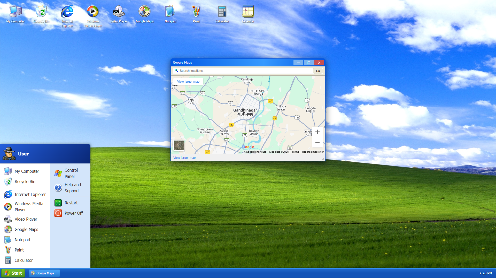

# CMR-VisionXP

A Windows XP simulation built with React and TypeScript, featuring a nostalgic UI experience with modern web technologies.



## 🌟 Features

- **Authentic Windows XP Experience** - Complete with the classic blue taskbar, start menu, and iconic desktop elements
- **Multiple Functional Applications**:
  - **My Computer** - Browse virtual file system
  - **Internet Explorer** - Simulated web browser
  - **Windows Media Player** - Play videos with an authentic XP interface
  - **Notepad** - Fully functional text editor
  - **Paint** - Draw and create art
  - **Calculator** - Perform basic calculations
  - **Calendar** - View and manage events
  - **Recycle Bin** - Delete and restore files

- **System Functionality**:
  - Bootup and shutdown sequences
  - Window management (minimize, maximize, close, resize)
  - Smooth animations and transitions
  - Start menu with program access
  - Desktop icon interaction

## 🛠️ Technology Stack

- **Frontend**: React + TypeScript
- **State Management**: Zustand
- **Styling**: CSS (no external UI libraries)
- **Build Tool**: Vite

## 🚀 Live Demo

Experience the nostalgia: [CMR-VisionXP Demo](https://clashmasterraghav.github.io/cmr-vision/)

## 💻 Getting Started

### Prerequisites

- Node.js (v14 or higher)
- npm or yarn

### Installation

1. Clone the repository:
   ```bash
   git clone https://github.com/ClashMasterRaghav/cmr-vision.git
   cd cmr-vision
   ```

2. Install dependencies:
   ```bash
   npm install
   # or
   yarn
   ```

3. Start the development server:
   ```bash
   npm run dev
   # or
   yarn dev
   ```

4. Open your browser and navigate to `http://localhost:5173`

## 📁 Project Structure

- `/src` - Source code
  - `/apps` - Individual application components (Notepad, Paint, etc.)
  - `/components` - Reusable UI components
  - `/stores` - State management (Zustand)
  - `/styles` - CSS stylesheets
  - `/utils` - Utility functions

## 🎯 Future Enhancements

- More applications (Minesweeper, Word, Excel)
- File system persistence using localStorage
- Improved error handling (Blue Screen of Death)
- Sound effects and startup sounds
- User accounts and login screen

## 🤝 Contributing

Contributions are welcome! Feel free to open issues or submit pull requests.

1. Fork the repository
2. Create your feature branch (`git checkout -b feature/amazing-feature`)
3. Commit your changes (`git commit -m 'Add some amazing feature'`)
4. Push to the branch (`git push origin feature/amazing-feature`)
5. Open a Pull Request

## 📄 License

This project is licensed under the MIT License - see the [LICENSE](LICENSE) file for details.

## 🙏 Acknowledgements

- Original Windows XP design by Microsoft
- Inspired by various web-based OS simulations
- Icons and assets sourced from publicly available Windows XP resources

---

Made with ❤️ by [ClashMasterRaghav](https://github.com/ClashMasterRaghav)